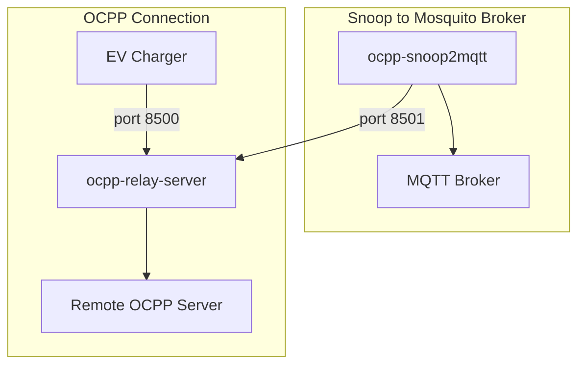

# OCPP Relay with Snooping and MQTT Metering

EV chargers are typically controlled by the [Open Charge Point Protocol](https://openchargealliance.org/protocols/open-charge-point-protocol/) \(OCPP\). The protocol includes metering. Extracting metering data from a charger is challenging if you have to implement a full Charge Point Management System \(CPMS\). The relay acts as a full CPMS to an EV charger but implements the service by relaying all requests to a real CPMS. The relay exposes a second service where OCPP traffic can be monitored. No commands are accepted on this snoop port. Multiple clients may connect to the snoop service and each one receives the same OCPP JSON stream.

The relay [ocpp-relay-server](ocpp-relay-server.py) should work with any charge point. Data is forwarded blindly. It is derived from https://github.com/saisasidhar/ocpp-relay.

The provided MQTT snoop client monitors OCPP messages and maps them to Home Assistant MQTT. Topics are discovered dynamically as metering data arrives. Discovery messages are published to "homeassistant/device/ocpp/\<charge point ID\>/config" and state under the prefix "ocpp/<charge point ID\>/".

By default the relay runs on port 8500 and the snoop service on port 8501. Configure an EV charger to connect to ws://your-server:8500/ and set the relay's ocpp-host to the server in the EV charger. The relay does support SSL, though some chargers don't have root certificates and require uploading all or part of your certificate chain. The MQTT client runs as a separate process, attaching to the snoop port on the relay.



For example, two processes:

```bash
# Start the relay (listens on ports 8500 and 8501 by default)
ocpp-relay-server --cpms wss://<actual OCPP server>/ws/webSocket &

# Snoop and forward to a Mosquito broker
ocpp-snoop2mqtt --mqtt-broker-username <user> --mqtt-broker-password <pw> --mqtt-broker-host=homeassistant
```

The scripts can load parameters either with a YAML configuration file or command line arguments. The
YAML file may be shared. See [configuration_example.yaml](configs/configuration_example.yaml). Both scripts
describe arguments with --help.

The scripts can be installed from the top-level with:

```bash
pip install .
```

OS-specific configuration files to run ocpp2mqtt as a service are stored in [init/](). There are not yet scripts to install them automatically.
